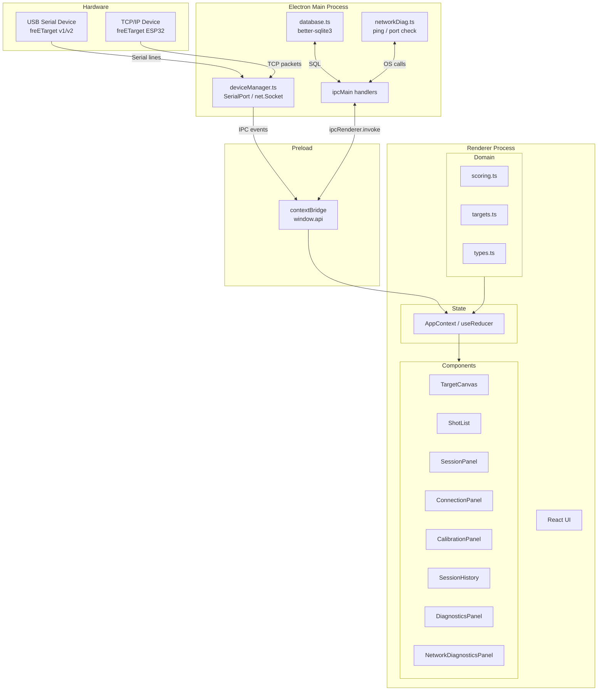
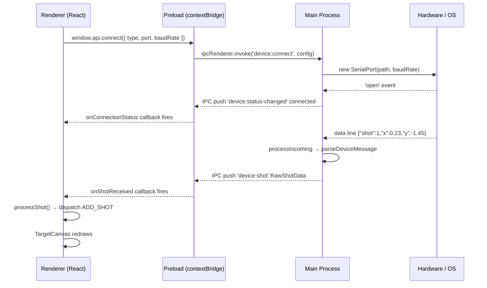
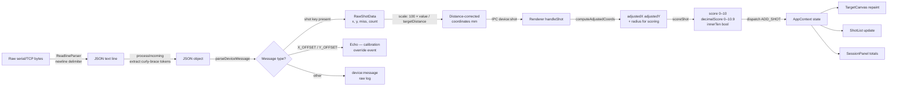
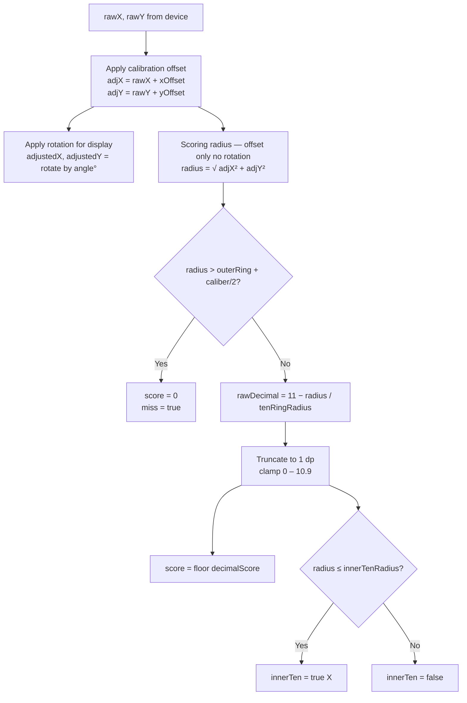
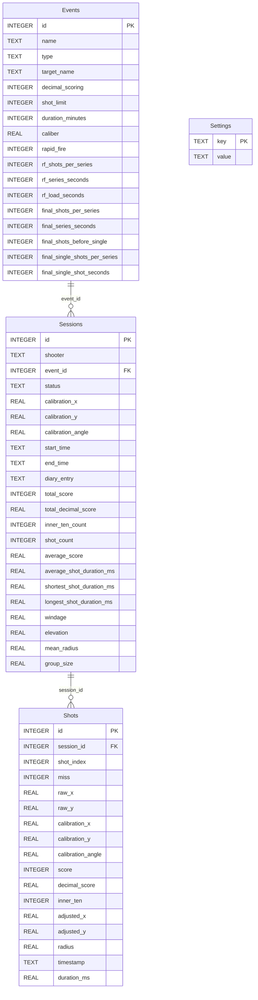
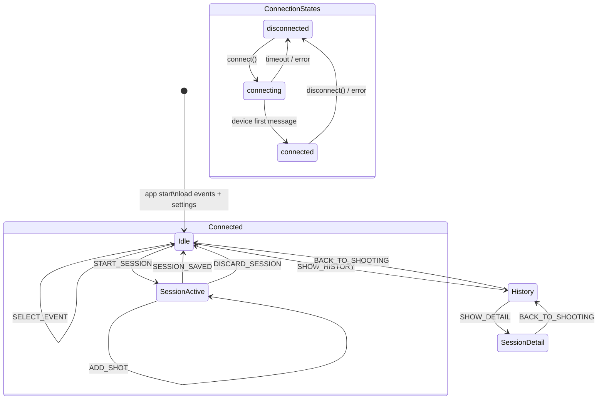
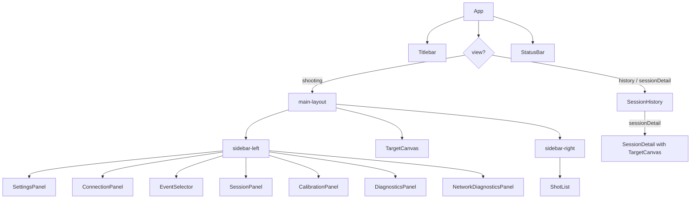

# freETarget — Desktop Scoring Application

A cross-platform desktop application for the [freETarget](https://github.com/freETarget/freETarget) electronic shooting target system. Connects to freETarget hardware over USB serial or TCP/IP, scores each shot in real time against ISSF target geometry, and maintains a full session history.

Supported disciplines: **10m Air Rifle** and **10m Air Pistol** in Practice, Match, and Final formats.

---

## Screenshots

> The main interface shows the target canvas, live shot list, and connection controls side by side. The history view shows past sessions with per-shot detail and group analysis.

---

## Table of Contents

- [Architecture](#architecture)
- [Process Model](#process-model)
- [Data Flow — Shot Processing](#data-flow--shot-processing)
- [Scoring Algorithm](#scoring-algorithm)
- [Device Protocol](#device-protocol)
- [Database Schema](#database-schema)
- [Application State](#application-state)
- [Component Tree](#component-tree)
- [Project Structure](#project-structure)
- [Prerequisites](#prerequisites)
- [Install and Run](#install-and-run)
- [Build for Distribution](#build-for-distribution)
- [Platform Notes](#platform-notes)
- [Configuration](#configuration)
- [Diagnostics](#diagnostics)

---

## Architecture

The application is built with **Electron 28**, **React 18**, and **TypeScript**. It follows Electron's recommended three-process model: a privileged main process that owns hardware I/O and persistence, an isolated renderer process that owns all UI and domain logic, and a preload script that bridges them through a strictly-typed context bridge API.



---

## Process Model

Electron enforces a hard security boundary between processes. The renderer has no direct access to Node.js APIs — all system calls go through the context bridge.



---

## Data Flow — Shot Processing

From raw hardware bytes to a scored, displayed shot:



---

## Scoring Algorithm

Scores are calculated using the ISSF acoustic-target formula, matching the original freETarget C# implementation exactly.



**Ten-ring radii by discipline:**

| Discipline | `tenRingRadius` | `innerTenRadius` |
|---|---|---|
| 10m Air Rifle | ring10/2 + caliber/2 = **2.5 mm** | caliber/2 − ring10/2 = **2.0 mm** |
| 10m Air Pistol | ring10/2 + caliber/2 = **8.0 mm** | innerRing/2 + caliber/2 = **4.75 mm** |

---

## Device Protocol

freETarget hardware sends newline-terminated JSON over USB serial (default 115 200 baud) or TCP (default `192.168.10.9:1090`).

**Incoming messages from device:**

| Message | Meaning |
|---|---|
| `{"shot":N,"x":F,"y":F}` | Hit — coordinates in mm from target centre |
| `{"shot":N,"miss":1}` | Miss detection — no valid acoustic solution |
| `{"shot":N,"x":F,"y":F,"r":F,"a":F}` | Hit with pre-computed radius and angle |
| `{"X_OFFSET":F,"Y_OFFSET":F,...}` | Device calibration echo — overrides local offsets |

Coordinates are **not** scaled by the device. The app applies a distance-correction factor: `scaled = 100 × raw / targetDistance` where `targetDistance` is a percentage (100 = standard competition distance).

**Outgoing commands to device:**

| Command | Effect |
|---|---|
| `{"VERSION":7}` | Request firmware version and device config (sent on connect) |
| Any JSON string | Passed through via `sendCommand` (visible in Diagnostics panel) |

---

## Database Schema

Session data is persisted locally using SQLite via `better-sqlite3`. The database file is stored in the platform user-data directory (`~/Library/Application Support/freetarget/storage.db` on macOS).



---

## Application State

The renderer maintains all UI and session state in a single `useReducer` store (AppContext). No external state library is used.



---

## Component Tree



---

## Project Structure

```
freeTarget-macos/
├── src/
│   ├── main/                    # Electron main process (Node.js)
│   │   ├── index.ts             # App lifecycle, IPC handlers
│   │   ├── deviceManager.ts     # USB serial + TCP connection and message parsing
│   │   ├── database.ts          # SQLite persistence (better-sqlite3)
│   │   ├── networkDiag.ts       # Ping, port check, interface enumeration
│   │   └── defaultEvents.ts     # Seed data for initial DB population
│   │
│   ├── preload/
│   │   └── index.ts             # contextBridge — typed window.api surface
│   │
│   └── renderer/src/
│       ├── App.tsx              # Root component, IPC wiring, shot handler
│       ├── App.css              # Global styles (dark theme, design tokens)
│       ├── domain/
│       │   ├── types.ts         # All TypeScript interfaces
│       │   ├── scoring.ts       # Shot scoring, calibration, series grouping, stats
│       │   └── targets.ts       # Target geometry definitions (AirRifle, AirPistol)
│       ├── store/
│       │   └── AppContext.tsx   # useReducer state store + all actions
│       └── components/
│           ├── TargetCanvas.tsx         # Canvas rendering — target rings + shots
│           ├── ShotList.tsx             # Per-shot score table by series
│           ├── SessionPanel.tsx         # Start/save/discard session controls
│           ├── ConnectionPanel.tsx      # USB/TCP connect controls + port selector
│           ├── CalibrationPanel.tsx     # X/Y/angle offset nudge controls
│           ├── EventSelector.tsx        # Course-of-fire dropdown
│           ├── SettingsPanel.tsx        # Modal — shooter name, connection, behaviour
│           ├── SessionHistory.tsx       # History list + session detail view
│           ├── StatusBar.tsx            # Bottom status strip
│           ├── DiagnosticsPanel.tsx     # Raw device message log + command sender
│           └── NetworkDiagnosticsPanel.tsx  # Ping, port check, interface list
│
├── electron.vite.config.ts      # electron-vite build configuration
├── tsconfig.json                # Root TypeScript config
├── tsconfig.node.json           # Main + preload compiler options
├── tsconfig.web.json            # Renderer compiler options
├── .npmrc                       # Redirect native builds to Electron headers
└── package.json
```

---

## Prerequisites

| Requirement | Version | Notes |
|---|---|---|
| Node.js | 18 or 20 LTS | 20 recommended |
| Xcode Command Line Tools | latest | `xcode-select --install` |
| Python 3 | any | needed by node-gyp for native modules |

---

## Install and Run

```bash
cd freeTarget-macos
npm install        # also rebuilds better-sqlite3 and serialport for Electron
npm run dev        # launch with hot reload
```

The first `npm install` compiles two native modules (`better-sqlite3`, `serialport`) against Electron's bundled Node headers. This takes a minute on first run.

---

## Build for Distribution

**macOS (DMG):**
```bash
npm run dist
# Output: release/freETarget-1.0.0-arm64.dmg
```

**macOS universal binary (Intel + Apple Silicon):**
```bash
npm run build && npx electron-builder --mac --universal
```

**Linux (AppImage + deb) — must run on a Linux host:**
```bash
sudo apt-get install -y build-essential python3 libudev-dev
npm install
npm run dist
# Output: release/freETarget-1.0.0.AppImage
#         release/freETarget-1.0.0.deb
```

The macOS build uses ad-hoc signing (`identity: null`). On first launch right-click → **Open** to bypass Gatekeeper, or strip the quarantine flag:
```bash
xattr -cr "release/mac-arm64/freETarget.app"
```

---

## Platform Notes

| Platform | Transport | Notes |
|---|---|---|
| macOS | USB serial | Device appears as `/dev/cu.usbmodem*` or `/dev/cu.usbserial*` |
| macOS | TCP/IP | Connect Mac to the target's Wi-Fi (`SSID: FET-*`) first |
| Ubuntu / Debian | USB serial | Appears as `/dev/ttyUSB0` or `/dev/ttyACM0`; add user to `dialout` group: `sudo usermod -aG dialout $USER` |
| Ubuntu / Debian | TCP/IP | Same Wi-Fi requirement applies |

---

## Configuration

Open **Settings** (top of left sidebar) to configure:

| Setting | Description |
|---|---|
| **Shooter name** | Stored with every session |
| **Connection type** | USB or TCP/IP |
| **Baud rate** | USB only — default 115 200 |
| **IP address / port** | TCP only — default `192.168.10.9:1090` |
| **Distance correction** | Scale factor % (100 = standard distance) |
| **Ignore misses** | Suppress miss detections from shot log |
| **Draw mean group** | Overlay group centre and mean radius circle |
| **Default event** | Event selected on startup |

**Calibration** (left sidebar) adjusts shot position after connection:

- **X / Y offset** — shift all shots in mm (±0.1 mm per nudge)
- **Angle** — rotate the coordinate frame in degrees
- Calibration is saved to settings and restored on next launch
- If the device sends `X_OFFSET` / `Y_OFFSET` in its config echo, those values override local offsets automatically

---

## Diagnostics

**Device Diagnostics** (left sidebar) opens a raw message log showing every line received from the device (`RX`, green) and every command sent (`TX`, blue). A command input at the bottom lets you send arbitrary JSON to the device while connected.

**Network** (left sidebar) provides TCP/IP troubleshooting:

- Lists active network interfaces and highlights the one on the same subnet as the configured target
- **Ping** — 4-packet ICMP test with RTT statistics
- **Check Port** — TCP connect attempt with 3-second timeout
- **Test All** — runs both in parallel

Typical failure patterns:

| Ping | Port | Likely cause |
|---|---|---|
| ✗ | ✗ | Mac not connected to `FET-*` Wi-Fi, or target is off |
| ✓ | ✗ | Target reachable but firmware not running / wrong port |
| ✓ | ✓ | Network OK — check connection settings in the app |
